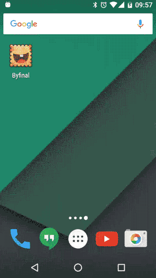
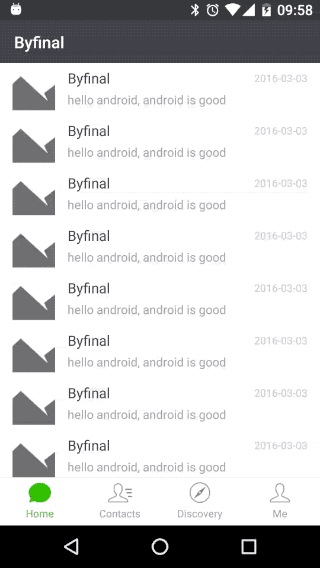
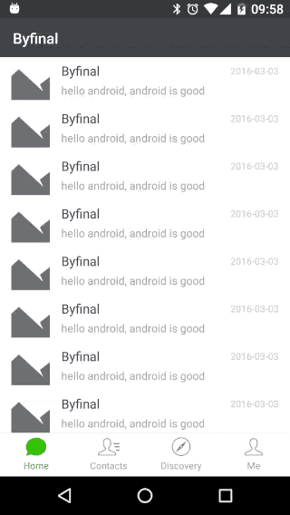

# byfinal4android
Android应用基础框架，主要包含下面几个功能：

* **欢迎页**：应用启动页，展示app品牌
* **基于tab的主页**：基于tab形式的首页设计
* **页面边缘滑动后退**：仿iOS的页面边缘滑动后退效果

## 欢迎页
<p align="center">
  
</p>

### 1 解决冷启动白屏问题
应用冷启动的时候，activity的界面渲染会有一段时间的白屏，为了解决这个问题，也有一个比较hack的方法。

通过给activity设置windowBackground的style方式，可以让系统渲染欢迎页的时候不出现白屏，具体代码如下:

```xml
<style name="AppTheme.Splash" parent="AppTheme.NoActionBar">
    <item name="android:windowBackground">@drawable/splash_bg</item>
</style>
```

### 2 Handler超时后跳转
使用Handler超时的方式，进行欢迎页的超时关闭，并切换到主页。

使用Handler的时候，需要注意内存泄露的问题，解决办法可以参考下面的代码，在activity的onPause的时候，移除所有的message和callback

```java
@Override
protected void onPause() {
    super.onPause();
    mHandler.removeCallbacksAndMessages(null);
}
```

### 3 配合Application，应用热启动不显示欢迎页
应用启动过之后，我们可以不需要让用户在欢迎页停留。
通过在Application实例中保留一个boolean值，欢迎页在onCreate的时候判断是否为true，是true则直接跳转到首页

```java
@Override
protected void onCreate(@Nullable Bundle savedInstanceState) {
    super.onCreate(savedInstanceState);

    mHandler = new Handler(this);

    BXLApplication application = (BXLApplication) Globals.getApplication();
    if (application.isLoaded) {
        mHandler.removeMessages(MSG_CONSUME_TIMEOUT);
        mHandler.sendEmptyMessage(MSG_CONSUME_FINISH);
    }
    setContentView(R.layout.activity_splash);
    application.isLoaded = true;
}
```

当然首页不能进行主动finish，在首页后退的时候采用moveTaskToBack，而不是使用默认的finish行为

```java
@Override
public boolean onKeyDown(int keyCode, KeyEvent event) {
    switch (keyCode) {
        case KeyEvent.KEYCODE_BACK:
            moveTaskToBack(false);
            return true;
    }
    return super.onKeyDown(keyCode, event);
}
```

## 基于viewpager的tab主页
<p align="center">
  
</p>

首页的设计采用viewpager的方式实现，亮点在于viewpager支持左右滑动，并且在滑动的时候tab高亮颜色支持跟随变化。

实现参考：[Android ViewPager+Fragment超高仿微信主界面（带底部图标切换动画）](http://blog.csdn.net/shenyuanqing/article/details/49464767)

## 仿iOS的页面边缘滑动后退
<p align="center">
  
</p>

activity从左边缘拖动后退的效果实现，参考Android微信的效果。
功能实现采用开源库[SlideActivity](https://github.com/chenjishi/SlideActivity)

## 后续一些常用功能继续补充

* 图片库
* 网络库
* 按优先级组件初始化
* app前后台状态监听
* ...

